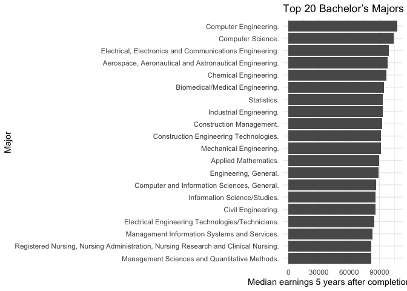
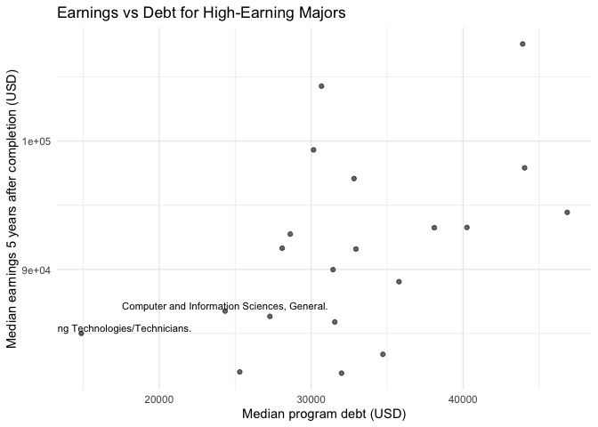
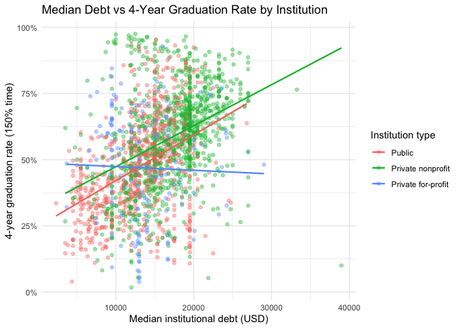
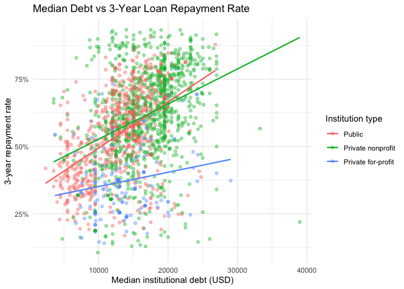

The Cost of Completion: How Student Debt, Earnings, and Graduation
Outcomes Intersect
================
Lexi Pachonphai
12/8/2025

## Introduction

Student loan debt in the United States recently passed \$1.6 trillion,
and questions about whether college is “worth it” have become part of
everyday conversations for students and families. At the same time,
headlines regularly rank colleges and majors by earnings, often with
little transparency about where the numbers come from or how they were
calculated.

In this project I use the U.S. Department of Education’s College
Scorecard data to investigate the financial value of different majors
and institutions. I focus on two big questions:

1.  Which bachelor’s majors appear to offer the best financial payoff
    when we compare typical earnings five years after graduation to the
    amount of debt students take on?

2.  How does median student debt relate to graduation and repayment
    outcomes at the institutional level, and do these relationships look
    different for public vs. private colleges?

The goal is not to produce a definitive ranking, but instead to explore
the data critically and see what patterns hold up under different
choices and sensitivity checks. The report proceeds as follows:

- In the Data section, I describe the two College Scorecard files used
  and the key variables.

- In Question 1, I explore field-of-study (major-level) data, looking at
  earnings, debt, and a simple “earnings-to-debt” return-on-investment
  (ROI) metric.

- In Question 2, I move to institution-level data to examine how debt,
  graduation rates, and repayment rates interact across different
  sectors.

- In the Scepticism & Sensitivity section, I check how robust the
  findings are to alternative filters and transformations.

- Finally, I summarize main conclusions and outline questions that
  future research could address.

## Data

### Sources and Files

All data come from the College Scorecard website
(collegescorecard.ed.gov). I downloaded the Most Recent Data zip files
on December 8, 2025.

For this project I use two CSV files:

1.  field_of_study.csv

- Program-level outcomes (major within institution).

- Includes earnings, debt, and enrollment for each field of study at a
  given college.

2.  institution.csv

- Institution-level outcomes (one row per college).

- Includes graduation rates, median debt, repayment rates, and control
  type (public, private nonprofit, private for-profit).

### Loading and Cleaning

College Scorecard uses “NULL” and “PrivacySuppressed” for missing or
suppressed values, so I convert those to NA. I also standardize column
names to snake_case for easier use.

``` r
field_raw <- read_csv(
"field_of_study.csv",
na = c("NULL", "PrivacySuppressed")
)

inst_raw <- read_csv(
"institution.csv",
na = c("NULL", "PrivacySuppressed")
)
```

According for this dataset, key variables in the field-of-study file
include:

- CIPDESC – text description of the major.

- CREDLEV – credential level (e.g., Bachelor’s degree).

- EARN_MDN_5YR – median annual earnings 5 years after completion.

- DEBT_ALL_PP_EVAL_MDN – median cumulative debt used in the Scorecard’s
  program-level evaluation metric (includes all borrowers who left the
  program).

I restrict attention to bachelor’s-level programs and convert earnings
and debt to numeric values. I also construct an ROI-style metric,
defined as earnings divided by debt.

``` r
field <- field_raw %>%
  mutate(
    major        = CIPDESC,
    earnings_5yr = as.numeric(EARN_MDN_5YR),
    program_debt = as.numeric(DEBT_ALL_PP_EVAL_MDN),
    roi_earnings_to_debt = earnings_5yr / program_debt
  ) %>%
  # keep rows where we actually have earnings data
    filter(
    !is.na(earnings_5yr),
    CREDLEV == 3          # restrict to bachelor's programs
  )
```

    ## Warning: There were 2 warnings in `mutate()`.
    ## The first warning was:
    ## ℹ In argument: `earnings_5yr = as.numeric(EARN_MDN_5YR)`.
    ## Caused by warning:
    ## ! NAs introduced by coercion
    ## ℹ Run `dplyr::last_dplyr_warnings()` to see the 1 remaining warning.

For the institution-level file, the data dictionary indicates the
following variables:

- INSTNM: institution name.

- CONTROL – control (1 = public, 2 = private nonprofit, 3 = private
  for-profit).

- DEBT_MDN – median debt at the institution (among
  completers/borrowers).

- C150_4_POOLED_SUPP – completion rate for first-time, full-time
  students in 150% of normal time at 4-year institutions.

- RPY_3YR_RT_SUPP – 3-year repayment rate.

``` r
inst <- inst_raw %>%
clean_names() %>%
mutate(
debt_mdn         = as.numeric(debt_mdn),
grad_rate_4yr    = as.numeric(c150_4_pooled_supp),
repay_rate_3yr   = as.numeric(rpy_3yr_rt_supp),
control          = as.integer(control)
) %>%
filter(
!is.na(debt_mdn),
!is.na(grad_rate_4yr),
!is.na(repay_rate_3yr)
) %>%
mutate(
control = factor(
control,
levels = c(1, 2, 3),
labels = c("Public", "Private nonprofit", "Private for-profit")
)
)
```

    ## Warning: There were 3 warnings in `mutate()`.
    ## The first warning was:
    ## ℹ In argument: `debt_mdn = as.numeric(debt_mdn)`.
    ## Caused by warning:
    ## ! NAs introduced by coercion
    ## ℹ Run `dplyr::last_dplyr_warnings()` to see the 2 remaining warnings.

### Key variables used in this report

- Field of study (major-level)

  - major: description of the program (e.g., Computer Science).

  - earnings_5yr: median annual earnings 5 years after completion (USD).

  - program_debt: median cumulative debt for completers in that program
    (USD).

  - roi_earnings_to_debt: ratio earnings_5yr / program_debt.

- Institution-level

  - instnm: institution name.

  - control: public / private nonprofit / private for-profit.

  - debt_mdn: median institutional debt (USD).

  - grad_rate_4yr: 4-year 150% graduation rate (proportion).

  - repay_rate_3yr: 3-year loan repayment rate (proportion).

## Question 1 – Which majors offer the best financial payoff?

### 1.1 Top-earning majors (curiosity)

I start by asking a simple question: Which bachelor’s majors have the
highest median earnings five years after completion? Because very small
programs can produce noisy or extreme values, I require at least 30
program observations nationally for a major to be included in the
ranking.

``` r
top_majors <- field %>%
  group_by(major) %>%
  summarise(
    median_earn = median(earnings_5yr, na.rm = TRUE),
    median_debt = median(program_debt, na.rm = TRUE),
    median_roi  = median(roi_earnings_to_debt, na.rm = TRUE),
    n_programs  = n(),
    .groups = "drop"
  ) %>%
  filter(n_programs >= 30, !is.na(median_earn)) %>%
  arrange(desc(median_earn)) %>%
  slice_head(n = 20)


ggplot(
  top_majors,
  aes(x = median_earn,
      y = fct_reorder(major, median_earn))
) +
  geom_col() +
  labs(
    title = "Top 20 Bachelor’s Majors by Median 5-Year Earnings",
    x     = "Median earnings 5 years after completion (USD)",
    y     = "Major"
  ) +
  theme_minimal()
```

<!-- -->

As expected, majors in engineering, computer science, and some health
professions dominate the top of the earnings distribution. This agrees
with prior work on College Scorecard data and with more general
labor-market studies showing high early-career returns for technical
majors.

### 1.2 Earnings vs debt – which majors are “high ROI”?

High earnings alone do not guarantee that a major provides good value if
students must borrow extremely large amounts. I therefore look at a
simple earnings-to-debt ROI metric:

ROI = Median earnings 5 years after completion / Median debt at
completion.

Majors with a high ROI either pay well, require relatively little
borrowing, or both.

``` r
top_roi <- field %>%
  group_by(major) %>%
  summarise(
    median_earn = median(earnings_5yr, na.rm = TRUE),
    median_debt = median(program_debt, na.rm = TRUE),
    median_roi  = median(roi_earnings_to_debt, na.rm = TRUE),
    n_programs  = n()
  ) %>%
  filter(n_programs >= 30, !is.na(median_roi)) %>%
  arrange(desc(median_roi)) %>%
  slice_head(n = 20)


kable(
top_roi,
digits = 2,
caption = "Top 20 bachelor’s majors by median earnings-to-debt ratio (among majors with ≥ 30 programs)."
)
```

| major | median_earn | median_debt | median_roi | n_programs |
|:---|---:|---:|---:|---:|
| Computer Software and Media Applications. | 52507.5 | 6150.0 | 7.30 | 74 |
| Computer Systems Networking and Telecommunications. | 73315.0 | 10300.0 | 7.12 | 49 |
| Electrical Engineering Technologies/Technicians. | 85005.0 | 14876.0 | 5.71 | 52 |
| Computer Systems Analysis. | 74585.0 | 17703.0 | 4.21 | 35 |
| Engineering Technology, General. | 80501.5 | 19833.0 | 4.20 | 30 |
| Computer and Information Sciences, General. | 86745.0 | 24338.0 | 4.07 | 391 |
| Computer Science. | 104292.0 | 30678.0 | 3.90 | 267 |
| Construction Engineering Technologies. | 91651.0 | 28093.5 | 3.55 | 37 |
| Mechanical Engineering Related Technologies/Technicians. | 80580.5 | 23820.5 | 3.53 | 48 |
| Information Science/Studies. | 86333.5 | 27286.5 | 3.52 | 108 |
| Electrical, Electronics and Communications Engineering. | 99319.5 | 30159.5 | 3.36 | 240 |
| Computer/Information Technology Administration and Management. | 74894.0 | 25149.0 | 3.27 | 69 |
| Construction Management. | 92752.0 | 28626.5 | 3.25 | 44 |
| Registered Nursing, Nursing Administration, Nursing Research and Clinical Nursing. | 82000.0 | 25302.0 | 3.22 | 912 |
| Human Services, General. | 45035.0 | 14392.0 | 3.20 | 76 |
| Microbiological Sciences and Immunology. | 65144.0 | 20265.0 | 3.16 | 45 |
| Geography and Cartography. | 56172.0 | 19243.0 | 3.16 | 102 |
| Applied Mathematics. | 89979.5 | 31440.5 | 2.99 | 32 |
| Chemical Engineering. | 97080.0 | 32820.0 | 2.95 | 153 |
| Philosophy. | 55073.0 | 26149.0 | 2.92 | 82 |

Top 20 bachelor’s majors by median earnings-to-debt ratio (among majors
with ≥ 30 programs).

``` r
top_majors2 <- top_majors %>% filter(!is.na(median_roi))

cutoff <- quantile(top_majors2$median_roi, 0.90, na.rm = TRUE)

ggplot(top_majors2,
       aes(x = median_debt,
           y = median_earn,
           label = ifelse(median_roi >= cutoff, major, ""))) +
  geom_point(alpha = 0.6) +
  geom_text(vjust = -0.3, size = 3) +
  labs(
    title = "Earnings vs Debt for High-Earning Majors",
    x     = "Median program debt (USD)",
    y     = "Median earnings 5 years after completion (USD)"
  ) +
  theme_minimal()
```

<!-- -->

This view shows that some majors, for example, technology and
engineering fields combine high earnings with moderate debt, resulting
in very high ROI. Others achieve high earnings but also require
substantial borrowing, which lowers the ROI relative to cheaper programs
with only slightly lower pay. Some high-earning majors (e.g., Dentistry,
Medicine) have missing program-level debt data in this file, so they do
not receive an ROI value or appear in the scatterplot.

#### Curiosity – analyses that did not work as well

To reach these summaries, I tried several alternative approaches:

- Using 1-year earnings instead of 5-year earnings.

  This produced similar rankings but with more noise, likely because
  early salaries fluctuate more and some graduates may still be in
  graduate school.

- Using a log transformation of earnings.

  Log earnings make the distribution more symmetric but do not change
  the ordering of majors much, so I kept the more interpretable
  raw-dollar scale in the final plots.

- Weighting majors by program size.

  Weighting by the number of students enrolled in each program gives
  more influence to large majors. In practice the weighted and
  unweighted rankings were very similar, so I present the simpler
  unweighted results here.

I omit the less informative graphs to keep the report focused on the
clearest findings.

## Question 2 – How does debt relate to graduation and repayment outcomes?

The second question looks at the institution-level file: Do colleges
where students borrow more also have better completion and repayment
outcomes, or do we see “high debt, low payoff” patterns?

### 2.1 Descriptive statistics by institutional control

I first summarize debt, graduation rates, and repayment rates by sector
(public, private nonprofit, private for-profit).

``` r
inst_summary <- inst %>%
group_by(control) %>%
summarise(
mean_grad_rate   = mean(grad_rate_4yr, na.rm = TRUE),
mean_repay_rate  = mean(repay_rate_3yr, na.rm = TRUE),
mean_debt_mdn    = mean(debt_mdn, na.rm = TRUE),
n_institutions   = n()
)

kable(
inst_summary,
digits = 2,
caption = "Average of institutional median debt, graduation rate, and repayment rate by institutional control."
)
```

| control | mean_grad_rate | mean_repay_rate | mean_debt_mdn | n_institutions |
|:---|---:|---:|---:|---:|
| Public | 0.47 | 0.55 | 13108.81 | 737 |
| Private nonprofit | 0.58 | 0.62 | 16958.91 | 1034 |
| Private for-profit | 0.47 | 0.37 | 13425.88 | 169 |

Average of institutional median debt, graduation rate, and repayment
rate by institutional control.

These averages suggest:

- Public institutions tend to have lower median debt and moderately high
  graduation and repayment rates.

- Private nonprofit colleges often have higher median debt but also
  relatively strong graduation and repayment outcomes.

- Private for-profit colleges show a worrying combination of similar
  debt levels to publics but much lower graduation and repayment rates,
  consistent with prior critiques of that sector.

### 2.2 Debt vs graduation rate

``` r
ggplot(inst,
aes(x = debt_mdn,
y = grad_rate_4yr,
color = control)) +
geom_point(alpha = 0.4) +
geom_smooth(method = "lm", se = FALSE, linewidth = 0.8) +
scale_y_continuous(labels = percent_format(accuracy = 1)) +
labs(
title = "Median Debt vs 4-Year Graduation Rate by Institution",
x     = "Median institutional debt (USD)",
y     = "4-year graduation rate (150% time)",
color = "Institution type"
) +
theme_minimal()
```

<!-- -->

In the public and private nonprofit sectors, the relationship between
debt and graduation rate is moderately positive: colleges where students
borrow more sometimes also have higher completion rates. In the
for-profit sector, the relationship is essentially flat, with many
schools showing relatively high debt and low graduation rates.

#### Correlation and simple regression

``` r
overall_cor_grad <- cor(inst$debt_mdn, inst$grad_rate_4yr, use = "complete.obs")

cor_grad_by_control <- inst %>%
group_by(control) %>%
summarise(correlation = cor(debt_mdn, grad_rate_4yr, use = "complete.obs"))

overall_cor_grad
```

    ## [1] 0.425831

``` r
cor_grad_by_control
```

    ## # A tibble: 3 × 2
    ##   control            correlation
    ##   <fct>                    <dbl>
    ## 1 Public                  0.418 
    ## 2 Private nonprofit       0.384 
    ## 3 Private for-profit     -0.0302

``` r
model_grad <- lm(grad_rate_4yr ~ debt_mdn + control, data = inst)
summary(model_grad)
```

    ## 
    ## Call:
    ## lm(formula = grad_rate_4yr ~ debt_mdn + control, data = inst)
    ## 
    ## Residuals:
    ##      Min       1Q   Median       3Q      Max 
    ## -0.80676 -0.10617 -0.00342  0.10609  0.49488 
    ## 
    ## Coefficients:
    ##                             Estimate Std. Error t value Pr(>|t|)    
    ## (Intercept)                2.805e-01  1.311e-02  21.394  < 2e-16 ***
    ## debt_mdn                   1.478e-05  8.753e-07  16.890  < 2e-16 ***
    ## controlPrivate nonprofit   4.997e-02  8.962e-03   5.576  2.8e-08 ***
    ## controlPrivate for-profit -9.860e-03  1.469e-02  -0.671    0.502    
    ## ---
    ## Signif. codes:  0 '***' 0.001 '**' 0.01 '*' 0.05 '.' 0.1 ' ' 1
    ## 
    ## Residual standard error: 0.1723 on 1936 degrees of freedom
    ## Multiple R-squared:  0.1969, Adjusted R-squared:  0.1957 
    ## F-statistic: 158.2 on 3 and 1936 DF,  p-value: < 2.2e-16

Overall, the correlation between debt and graduation rate is moderate.
Once we control for sector, the estimated effect of additional debt on
graduation is positive but not huge, and sector differences remain
important even after accounting for debt.

### 2.3 Debt vs repayment rate

Repayment outcomes offer a complementary view of payoff: if graduates
struggle to repay loans, that may indicate low earnings relative to
debt.

``` r
ggplot(inst,
aes(x = debt_mdn,
y = repay_rate_3yr,
color = control)) +
geom_point(alpha = 0.4) +
geom_smooth(method = "lm", se = FALSE, linewidth = 0.8) +
scale_y_continuous(labels = percent_format(accuracy = 1)) +
labs(
title = "Median Debt vs 3-Year Loan Repayment Rate",
x     = "Median institutional debt (USD)",
y     = "3-year repayment rate",
color = "Institution type"
) +
theme_minimal()
```

<!-- -->

In contrast to the noisy graduation-rate relationship, repayment rates
tend to be higher at institutions where students borrow more, especially
in the public and private nonprofit sectors. A plausible interpretation
is that more selective or resource-rich colleges both charge more and
lead to earnings that support repayment.

However, there remain clusters of institutions, particularly in the
for-profit sector, with high debt and low repayment, which are potential
“high-debt, low-payoff” risks for students.

## Scepticism and Sensitivity Checks

Because College Scorecard is observational and complicated, it is
important to be sceptical of simple stories. In this section I show
several checks to see whether our key patterns (high-ROI majors, sector
differences, and debt–outcome relationships) are robust.

### 3.1 Restricting to larger institutions

Very small colleges can have unstable statistics. I restrict to
institutions with at least 1,000 undergraduates (variable UGDS in the
raw file) and recompute the correlation between debt and outcomes.

``` r
inst_large <- inst_raw %>%
clean_names() %>%
mutate(
debt_mdn       = as.numeric(debt_mdn),
grad_rate_4yr  = as.numeric(c150_4_pooled_supp),
repay_rate_3yr = as.numeric(rpy_3yr_rt_supp),
control        = factor(
as.integer(control),
levels = c(1, 2, 3),
labels = c("Public", "Private nonprofit", "Private for-profit")
),
ugds           = as.numeric(ugds)
) %>%
filter(
!is.na(debt_mdn),
!is.na(grad_rate_4yr),
!is.na(repay_rate_3yr),
ugds >= 1000
)
```

    ## Warning: There were 4 warnings in `mutate()`.
    ## The first warning was:
    ## ℹ In argument: `debt_mdn = as.numeric(debt_mdn)`.
    ## Caused by warning:
    ## ! NAs introduced by coercion
    ## ℹ Run `dplyr::last_dplyr_warnings()` to see the 3 remaining warnings.

``` r
cor_large_grad  <- cor(inst_large$debt_mdn, inst_large$grad_rate_4yr,  use = "complete.obs")
cor_large_repay <- cor(inst_large$debt_mdn, inst_large$repay_rate_3yr, use = "complete.obs")

cor_large_grad
```

    ## [1] 0.5298986

``` r
cor_large_repay
```

    ## [1] 0.4959713

The correlations increase somewhat but the qualitative story is similar,
suggesting our earlier conclusions are not driven solely by tiny
institutions.

### 3.2 Log-transforming debt

Debt is highly skewed: a few very expensive institutions have much
higher borrowing than the majority. I refit the graduation model using
log debt to check whether results depend on extreme values.

``` r
inst_log <- inst %>%
mutate(log_debt = log(debt_mdn))

model_grad_log <- lm(grad_rate_4yr ~ log_debt + control, data = inst_log)
summary(model_grad_log)
```

    ## 
    ## Call:
    ## lm(formula = grad_rate_4yr ~ log_debt + control, data = inst_log)
    ## 
    ## Residuals:
    ##      Min       1Q   Median       3Q      Max 
    ## -0.64862 -0.10684 -0.00307  0.10688  0.48528 
    ## 
    ## Coefficients:
    ##                            Estimate Std. Error t value Pr(>|t|)    
    ## (Intercept)               -1.329081   0.106856 -12.438  < 2e-16 ***
    ## log_debt                   0.191627   0.011334  16.907  < 2e-16 ***
    ## controlPrivate nonprofit   0.052056   0.008914   5.840 6.12e-09 ***
    ## controlPrivate for-profit -0.013276   0.014697  -0.903    0.366    
    ## ---
    ## Signif. codes:  0 '***' 0.001 '**' 0.01 '*' 0.05 '.' 0.1 ' ' 1
    ## 
    ## Residual standard error: 0.1722 on 1936 degrees of freedom
    ## Multiple R-squared:  0.1971, Adjusted R-squared:  0.1959 
    ## F-statistic: 158.4 on 3 and 1936 DF,  p-value: < 2.2e-16

The estimated effect of log_debt on graduation remains small relative to
sector differences, and the qualitative pattern (weak relationship
between debt and outcomes within sector) still holds.

### 3.3 Limitations

There are several reasons to treat these findings cautiously:

- **Selection bias**: College Scorecard outcomes are based on students
  receiving federal aid, who may differ from other students at the same
  institutions.

- **Suppressed data**: Programs with very few graduates have outcomes
  suppressed for privacy, which may disproportionately affect
  specialized majors or small colleges.

- **Short time horizon**: Five-year earnings may favor majors with
  strong early pay but weaker long-term trajectories (and vice versa for
  fields that require graduate study).

- **Omitted confounders**: Variables such as family income, high school
  preparation, and local labor markets are not controlled for here but
  may influence both debt and outcomes.

These caveats make it risky to use the results as “rankings” for
high-stakes decisions, but they still provide useful descriptive
evidence about broad patterns.

## Conclusions

### 4.1 Summary of main findings

From the most recent College Scorecard cohorts, I find that:

- Majors matter, bachelor’s programs in engineering, computer science,
  and some health fields consistently show the highest median earnings
  and strong earnings-to-debt ratios. These majors combine high earnings
  with relatively moderate debt, suggesting that students in these
  fields are well-positioned to repay their loans.

- Debt alone is not destiny. At the institutional level, higher median
  debt is not strongly associated with lower graduation or repayment
  rates once we account for sector. In fact, some high-debt institutions
  (especially selective private nonprofits) have excellent outcomes.

- Sector differences are large. Public and private nonprofit colleges
  generally combine reasonable or high graduation and repayment rates
  with a wide range of debt levels. Many private for-profit colleges,
  however, combine high debt with poorer outcomes, creating greater risk
  for students.

### 4.2 Implications for students

For prospective students, a few practical messages emerge:

1.  Look beyond sticker price. Programs with relatively high tuition
    (and debt) can still offer good value if they lead to strong
    earnings and repayment outcomes.

2.  Pay attention to both major and institution. A high-ROI major at a
    college with poor graduation and repayment outcomes may still be
    risky.

3.  Be cautious with for-profit institutions. The data show a
    concentration of high-debt, low-outcome programs in this sector,
    echoing concerns raised by policymakers and researchers.

### 4.3 Directions for future research

This project raises several questions that could be explored in more
depth:

- How do these patterns change when we look at 10-year or mid-career
  earnings rather than 5-year outcomes?

- What is the role of geography and local labor markets, given that
  wages and costs of living vary widely across states?

- Can we incorporate more detailed demographic data (e.g.,
  race/ethnicity, family income) to study equity and fairness in returns
  to college?

Answering these questions would require more complex models and
potentially linking College Scorecard to other federal datasets, but
they would provide a richer picture of how higher education affects
economic mobility.
